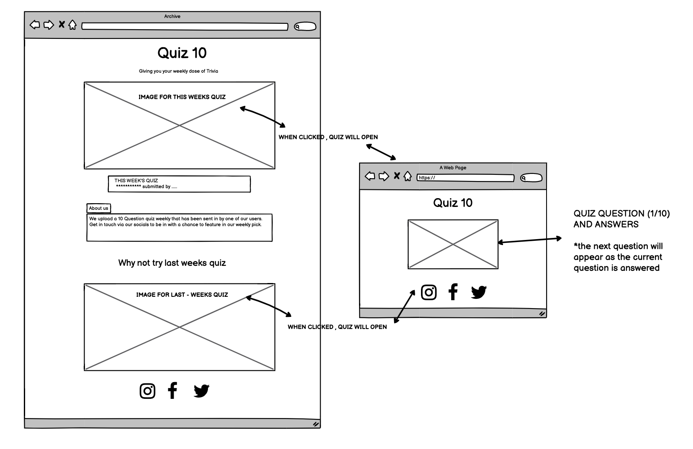
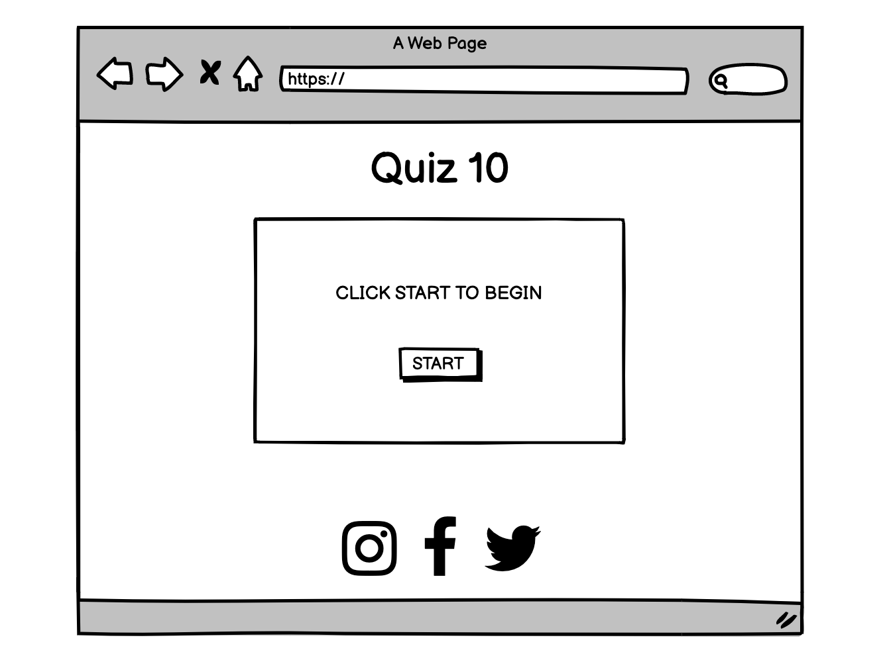
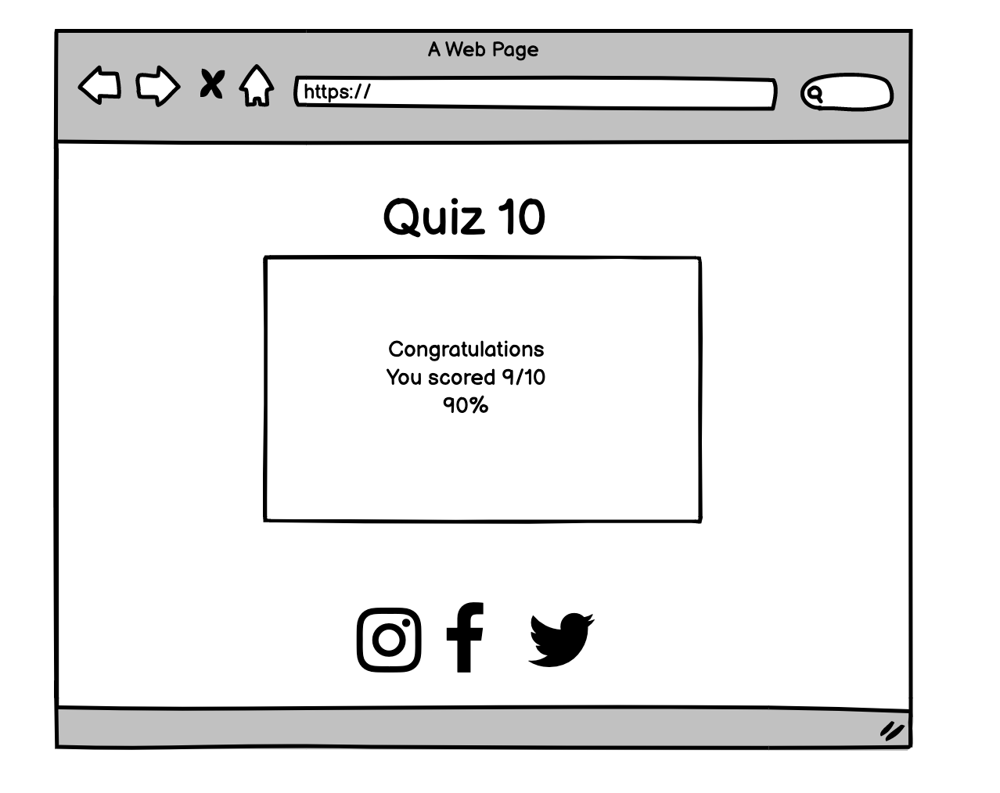
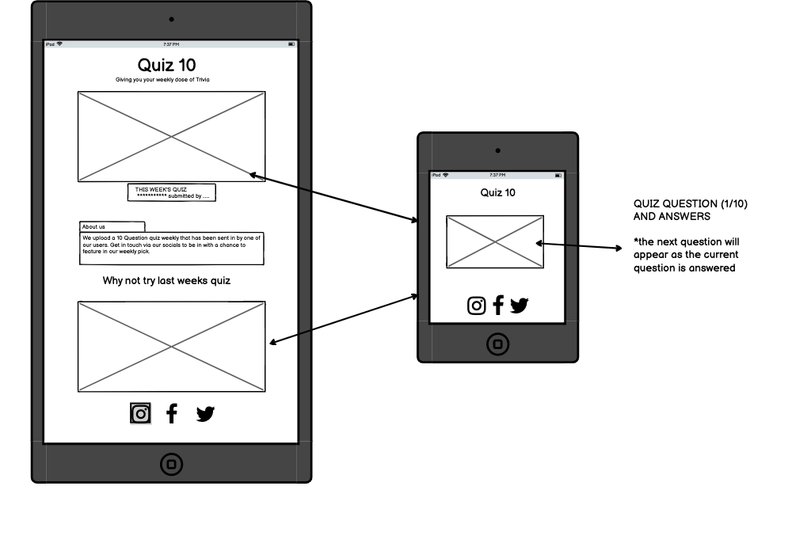
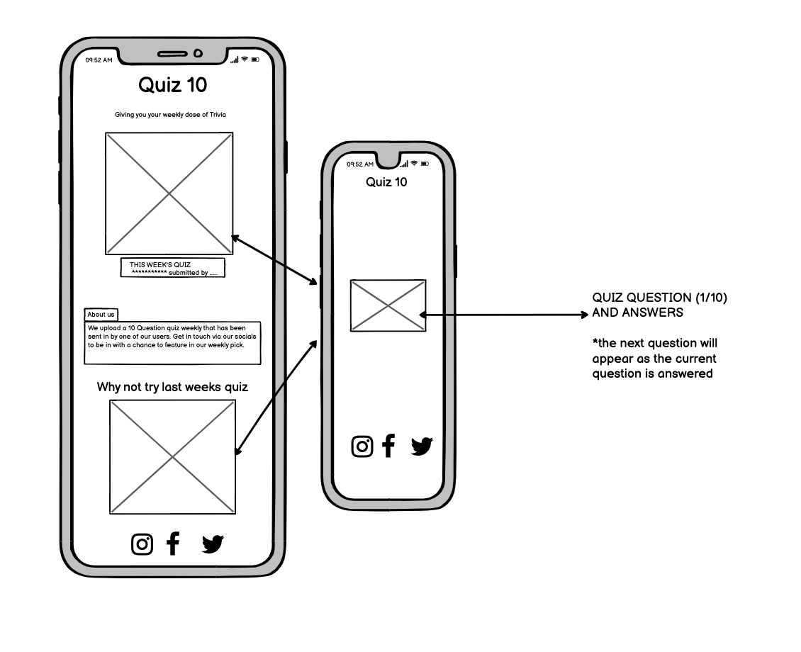
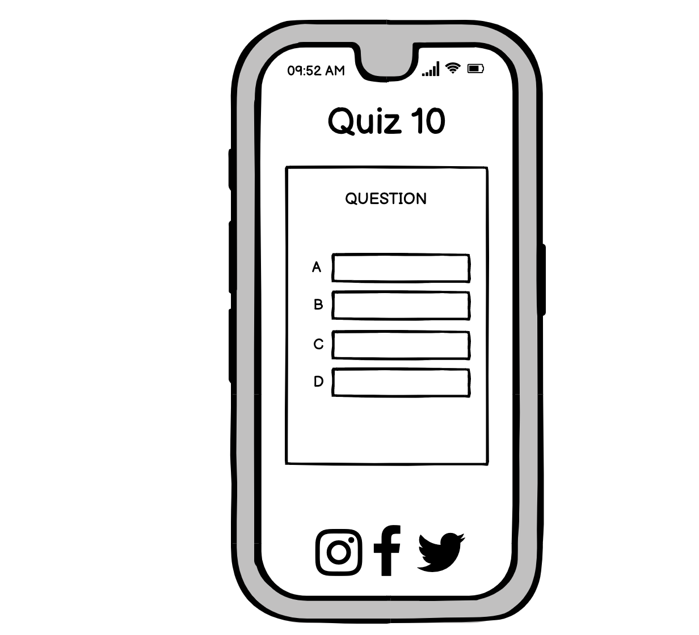
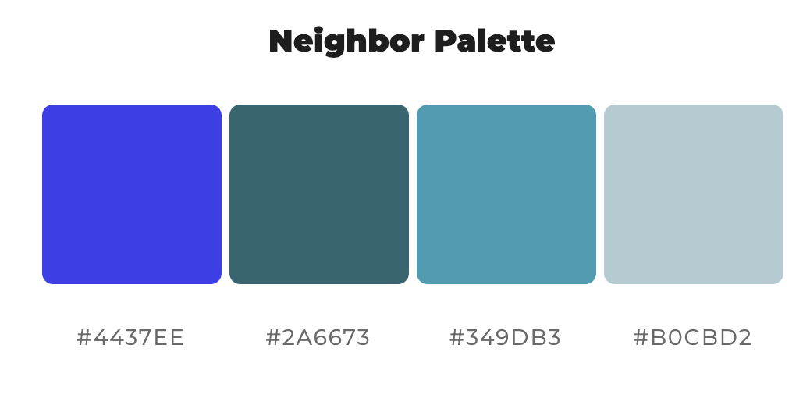

# Quiz 10 - Portfolio Project 2 JS/CSS/HTML

### Table Of Contents
* Objective
* Concept
  - Wireframes
* UX design
* Design
   - Colour Scheme
   - Typography
   - Imagery and site layout
* Features
* Technologies used
* Testing
  - Manual testing
  - Validation
  - Bugs/errors
* Deployment
* Credits

### Introduction

This website offers a new quiz weekly to the user. Each quiz has 10 questions and the user will be given their score /10 once completed. The site entices the user to engage by allowing users to submit quizzes through their social media platforms. 

The site will use HTML, CSS and Javascript to create an interactive, engaging and easy to use quiz site.

## UX and UI

### User Goals
* As a user, I want to easily navigate through the site.
* As a user, I want to be able to play the current weeks quiz.
* As a user, I want to see what score I have achieved from the quiz.

### Returning User Goals
* As a returning user, I want to play the most recent quiz.
* As a returning user, I want to play the past weeks quiz.
* As a returning user, I want to find the sites social links.

### Site Owner Goals
* As the site owner, I want the user to play the previous quiz if they've missed it.
* As the site owner, I want the user to have a pleasant interactive experience.
* As the site owner, I want the user to engage with us through our social media platforms.

### Wireframes

Desktop

Tablet  

Phone

## Design

### Colour Scheme
RGB
 
 * I wanted the site to be bright and have bursts of colour throughout.
 * I used colour space to create a neighbour palette involving two main colours, blue and purple. I used them throught out the site and kept the colour palette in theme with the quiz type themselves. 
 
### Typography
 * Darker Grotesque
 * Roboto

### Imagery

* Images used on the site were all sourced from  
* Striking imagery was used on the site to catch the users eye.
* An image of penguins is seen on first glance, successfully telling the user what the quiz is about through the image alone. Similarly, the photo for the Harry Potter quiz displays a photo of the castle and a sign for 'hogwarts'.
* Background imagery is used for both quizzes. The images used further display the theme of the quiz, allowing the user to fully immerse in the quiz without another distraction in the background.

### Site Layout

* The site consists of a main home page which displays 'this weeks' and 'last weeks' quiz to the user. Once the quiz is clicked, a new window will apppear displaying the corresponding quiz. 

### Features to be implemented
    
### Technologies used

* Balasmaiq
* Font Awesome
* Google fonts
* Beautify
* colour-space
* Techsini 
* W3C Markup, CSS validations and JShint
* favicon
* Google chrome- dev tools
       
