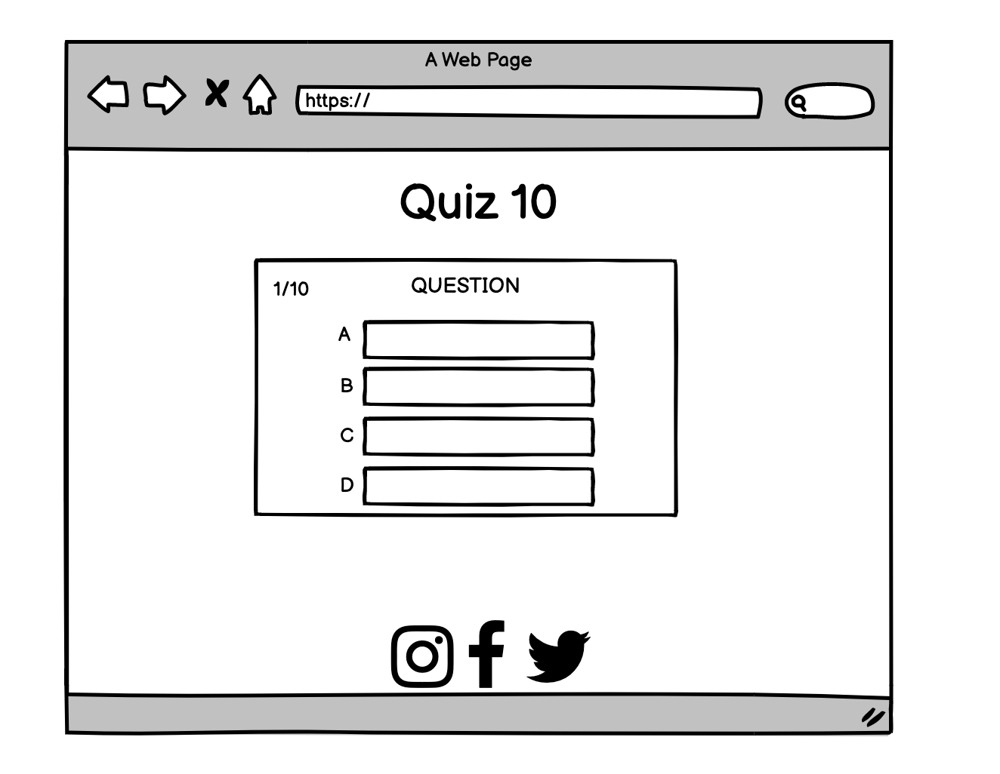

# Quiz 10 - Portfolio Project 2 JS/CSS/HTML

### Table Of Contents
* Objective
* Concept
  - Wireframes
* UX design
* Design
   - Colour Scheme
   - Typography
   - Imagery
* Site layout
* Features to be implemented
* Technologies used
* Testing
  - Manual testing
  - Validation
  - Bugs/errors
* Deployment
* Credits

### Introduction

This website offers a new quiz weekly to the user. Each quiz has 10 questions and the user will be given their score /10 once completed. The site entices the user to engage by allowing users to submit quizzes through their social media platforms. 

The site will use HTML, CSS and Javascript to create an interactive, engaging and easy to use quiz site.

## UX and UI

### User Goals
* As a first time user, I want to easily navigate through the site.
* As a first time user, I want to be able to play the current weeks quiz.
* As a first time user, I want to see what score I have achieved from the quiz.

### Returning User Goals
* As a returning user, I want to play the most recent quiz.
* As a returning user, I want to play the past weeks quiz.
* As a returning user, I want to find the sites social links.

### Site Owner Goals
* As the site owner, I want the user to play the previous quiz if they've missed it.
* As the site owner, I want the user to have a pleasant interactive experience.
* As the site owner, I want the user to engage with us through our social media platforms.

### Wireframes

Desktop

Tablet  

Phone

## Design

### Colour Scheme
RGB
 
 * I wanted the site to be bright and have bursts of colour throughout.
 * I used colour space to create a neighbour palette involving two main colours, blue and purple. I used them throught out the site and kept the colour palette in theme with the quiz type themselves. 
 
### Typography
 * Darker Grotesque
 * Roboto

### Imagery

* Images used on the site were all sourced from [Pixabay](https://pixabay.com/) 
* Striking imagery was used on the site to catch the users eye.
* An image of penguins is seen on first glance, successfully telling the user what the quiz is about through the image alone. Similarly, the photo for the Harry Potter quiz displays a photo of the castle and a sign for 'hogwarts'.
* Background imagery is used for both quizzes. The images used further display the theme of the quiz, allowing the user to fully immerse in the quiz without another distraction in the background.

### Site Layout

* The site consists of a main home page which displays 'this weeks' and 'last weeks' quiz to the user. Once the quiz is clicked, a new window will apppear displaying the corresponding quiz. 

### Features to be implemented

* A scoreboard feature where the user's score could be stored and shown so they can compare there score to previous plays.
* A time feature could be implemented in the future so there would an added challenge for the user when completing the quiz.
    
## Technologies used

- [Balsamiq](https://balsamiq.com/)
   * I used Balsamiq to create my wireframes for phone, tablet and desktop devices.     
- [Font Awesome](https://fontawesome.com/)
   * Font awesome icons were used on the site for the social media icons in the footer aswell as featuring in the final results page of both quizzes    
- Google fonts
   * Both fonts that I used through the site were taken from google fonts.      
- Beautify
   * The VS code extension was used to auto format my code
- colour-space
   * A neighbour palette of colours was generated on colour space to be used on site     
- Techsini 
   * A multi device image was generated on [techsini.com](https://techsini.com/multi-mockup/)    
- W3C Markup, CSS and JShint validators
   * I used the [HTML](https://validator.w3.org/) , [CSS](https://jigsaw.w3.org/css-validator/) and [JS](https://jshint.com/) to validate my code and ensure there were no errors.    
 - Favicon
   * I upload an image to favicon which created a usable icon for my site.     
- Google chrome- dev tools
   * Devtools from google chrome was used heavily during the project while styling the project and while adding media queries. It also aided in finding issues with my javascript code.

## Testing

### User Story Testing
  
- "As a first time user, I want to easily navigate through the site."
  * The easy layout of the main page allows the user to easily navigate between the two quizzes on the home page. The quizzes allow the user to return to the main home page once completion of quiz has occurred.
  
- "As a first time user, I want to be able to play the current weeks quiz."
  * The user is welcomed to the site by the current quiz on display as soon as the home page loads. This aswell as the easy layout of the quiz ensures the user can play the quiz easily and effectively.
    
- "As a first time user, I want to see what score I have achieved from the quiz."
  * The user can see what score out of 10 they have achieved after completing all 10 questions.

### Returning visitor goals

- " As a returning user, I want to play the most recent quiz."
  * A new quiz is uploaded on a weekly basis so returning quiz users will get to experience a new quiz.
  
- "As a returning user, I want to play last weeks quiz."
   * Last weeks quiz is displayed further down the home page. Last week's quiz ensures users have had enough time to complete older quizzes they may have missed.

- "As a returning user, I want to find the sites social links."
   * The social links are displayed down at the bottom of the footer on the main pages so the user can access all social platforms 

### Manual testing

#### The site
I carried out a variety of manual tests to ensure the site worked and displayed as it was supposed to.
  - Responsiveness was checked by viewing the site on a number of screen sizes using the Chrome Dev tools and through my own devices.
  - The site was tested on Google chrome, Safari and Microsoft edge.
  - I ensured that the anchor elements used for the social links in the footer worked correctly, directing the user to the correct social side in a new tab. 
  - The anchor elements used on the main page for both quizzes were checked to ensure the user could click both the quiz title or the quiz image and be successfully redirected to the correct quiz.
  
 #### The Quiz
 I carried out a number of manual checks for both quizzes to ensure the quiz element ran smootly.
  - The start and begin button were tested to ensure they brought the user to where they should.
  - I ensured the next button only appeared on each question after the user had selected an answer. 
  - On the final question, I checked to make sure the 'next' button disappeared and the  'final result' button appeared. 
  - The exit and reset buttons on the final result page of the quiz where also tested to ensure they redirected the user to where they chose. 
  - Both the score and count elements were tested to ensure they acted how they should.
  - I ensured the correct answer for each question was right and displayed as so.
   

### Validation

- All code was ran through online validation services to ensure my code was valid and free from errors.

* CSS validator 

* HTML validator

* Javascript Validator

* Lighthouse - Google chrome dev tools 
 - The lighthouse feature tested my site for performance, accessibility, best practices nd SEO. All scores were high for each category.

### Bugs/errors

#### Resolved
  - When creating the quiz, I noticed the user was able to click more than one answer for each question and therefore resulting in a constant score increment if the correct answer was selected more than once. 
  
  SOLUTION
- After researching and talking to a tutor at the code institute, I fixed this issue by declaring a variable and setting it to false. When the user was able to select an answer, this variable was set to true and then set back to false once the user had selected one answer. This ensured the quiz had better functionality and accuracy with the score.

- Minor syntax issues were found in the code when it was passed through the online validators. These were easily fixed.

## Deployment 
- This project was created in Gitpod.
 1) On Gitpod, click on the correct site repository
 2) Underneath the repository name, click the settings button
 3) On the left hand side of the settings page, scroll down to the pages section
 4) On this page, under source, choose the main or none option from the menu. Choose root location.
 5) Click Save

